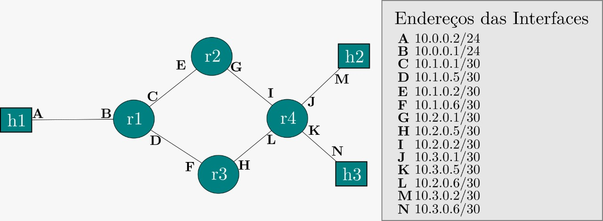

# network-simulator
My network simulator made for college. In Python. Built with too much coffee.

Relatório Redes Sistemas de Informação

Universidade Federal Fluminense
Lucas Hippertt
Pedro Fadel

Introdução:
O programa simulador apresentado foi desenvolvido em Python 3.6.0, utilizando bibliotecas como socket, sys e _threads. Para compilar o código, precisamos primeiramente configurar o computador onde será executado, para que ele possua as interfaces virtuais que serão utilizadas abertas. Para isso, utilizamos o NETCTL do Linux.

Configuração:
O projeto está separado em 4 arquivos, sendo elas **main**, **server**, **socket_utils** e **validate**.

A **main** trata da comunicação entre o simulador e o usuário, contendo o menu principal e abrindo as threads necessárias para receber dados de outras instâncias do simulador.

O **server** é o arquivo principal do simulador, responsável por abrir os arquivos, chamar as funções de validação definidas no arquivo **validate** e chamar a **main**, passando os argumentos recebidos pelo usuário para esta, caso as validações estejam corretas.

**Validate** é o arquivo onde se encontram as verificações de integridade do sistema, como verificação de tamanho de arquivo e validação de máscaras.

**Socket_utils** é a responsável por realmente implementar o simulador. É nesse arquivo que estão as funções de criação e leitura do cabeçalho IPV4, roteamento, recebimento e leitura da mensagem.

Problema do Roteamento:

Requisitos:
Deve estar presente a tabela de roteamento de todos os nós da topologia.
A tabela de H1 deve ser a menor possível.
Pacotes de H1 para H2 devem passar por R2.
Pacotes de H1 para H3 devem passar por R3.

Solução encontrada:
Roteamento
Nó destino      Ip do Enlace de saída - Rótulo do enlace 
-------------------------------

TABELA DE R1
H1 10.0.0.1/24 - B

H2 10.1.0.1/30 - C
R2 10.1.0.1/30 - C

H3 10.1.0.5/30 - D
R3 10.1.0.5/30 - D

R4 10.1.0.5/30 - D

-------------------------------

TABELA DE R2
H1 10.1.0.2/30 - E
R1 10.1.0.2/30 - E

H2 10.2.0.1/30 - G
H3 10.2.0.1/30 - G
R4 10.2.0.1/30 - G

R3 10.2.0.1/30 - G

-------------------------------

TABELA DE R3
H1 10.1.0.6/30 - F
R1 10.1.0.6/30 - F

H2 10.2.0.5/30 - H
H3 10.2.0.5/30 - H
R4 10.2.0.5/30 - H

R2 10.2.0.5/30 - H

-------------------------------

TABELA DE R4
H1 10.2.0.6/30 - L
R1 10.2.0.6/30 - L

H2 10.3.0.1/30 - J
H3 10.3.0.5/30 - K

R2 10.2.0.2/30 - I
R3 10.2.0.6/30 - L

-------------------------------

TABELA DE H1
0.0.0.0 - 10.0.0.2/24 - A

-------------------------------

TABELA DE H2
0.0.0.0 - 10.3.0.2/30 - M

-------------------------------

TABELA DE H3
0.0.0.0 - 10.3.0.6/30 - N   

